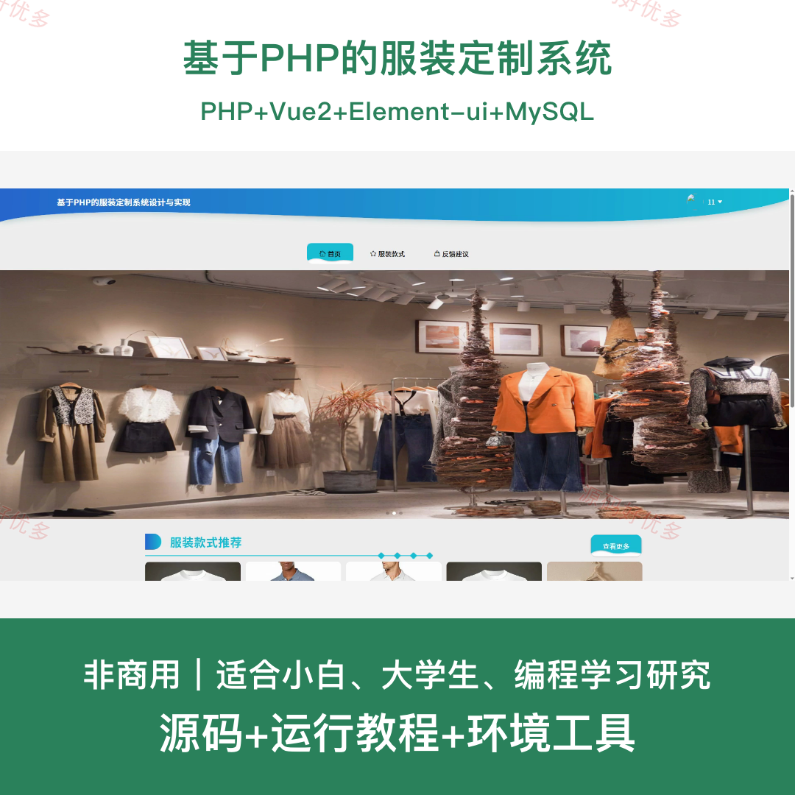
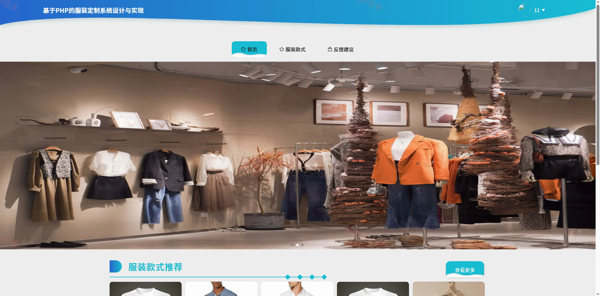
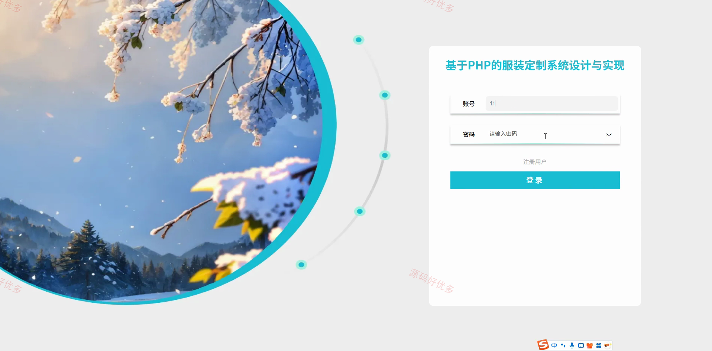
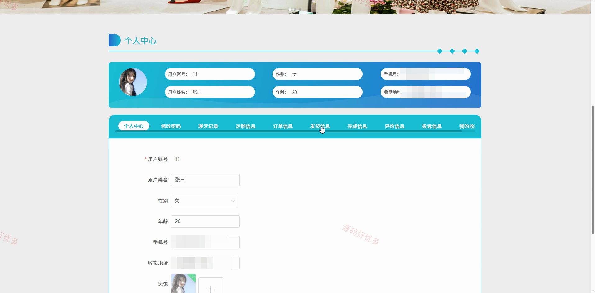
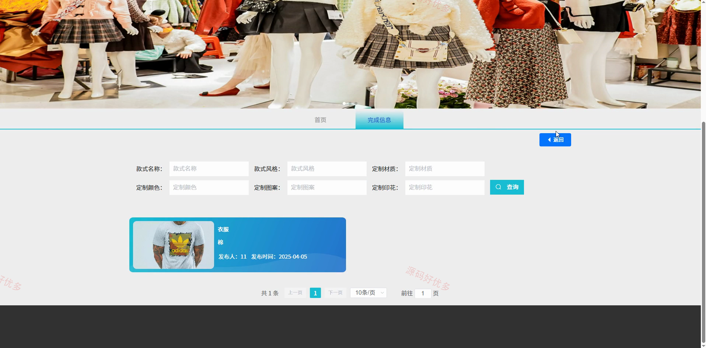
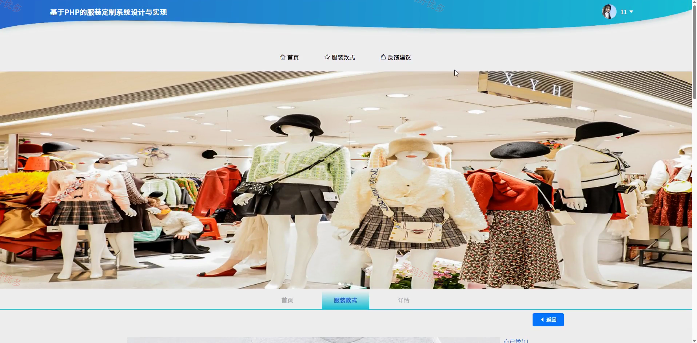
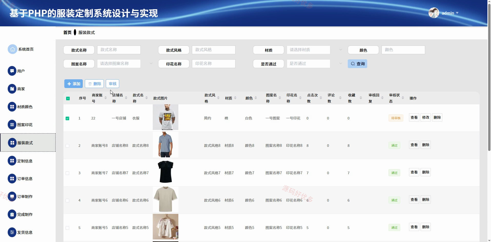
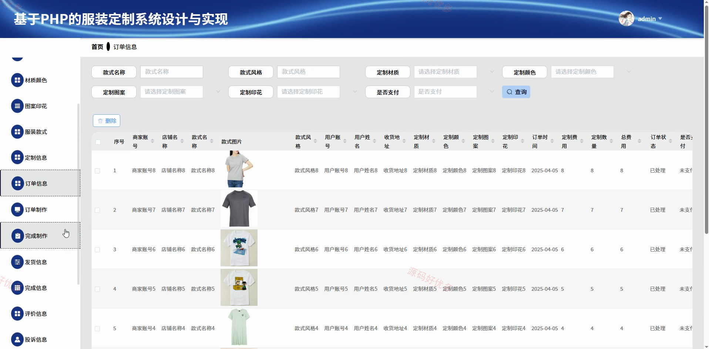
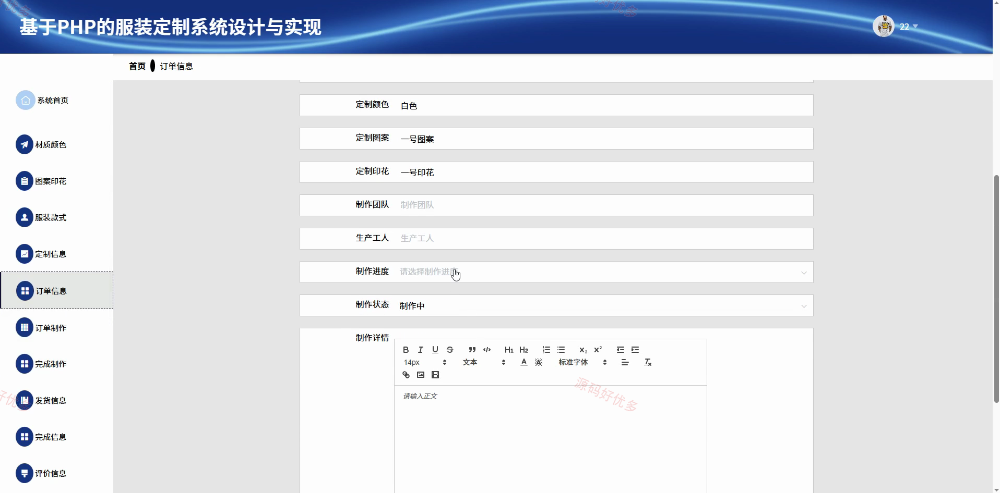

## 源码问题查看主页咨询

### 一、关键词
服装定制、个性化服饰、面料配色、印花设计、定制服装订单

### 二、作品包含
源码+数据库+全套环境和工具资源+本地部署教程

### 三、项目技术
前端技术： Html、Css、Js、Vue2.6、Element-ui
后端技术：PHP

### 四、运行环境（以下版本亲测，其他版本兼容性请自行测试）
开发工具：PhpStorm/VSCODE + VSCODE

数据库：MySQL5.7+（共20张表）

数据库管理工具：Navicat10以上版本

环境配置软件： PHP

前端Nodejs：14+

浏览器：谷歌浏览器

### 五、项目介绍
项目编号：php006D

系统面向用户、商家和管理员，围绕服装款式、材质颜色与图案印花实现在线定制，并衔接订单支付、制作、发货、签收、评价和投诉等完整流程。

角色：用户、商家、管理员

用户功能：服装款式浏览与定制、商家私聊沟通、定制信息查看、订单查看与支付、发货信息查看与签收、完成信息查看、订单评价与投诉。

商家功能：材质颜色与图案印花管理、服装款式管理、定制信息处理、订单查看与制作安排、制作进度与完工登记、服装发货、完成信息与评价查看。

管理员功能：用户与商家审核管理、材质颜色与图案印花管理、服装款式审核管理、定制信息与订单管理、制作与发货进度管理、评价与投诉管理、反馈建议回复、轮播图管理。

### 六、运行截图

